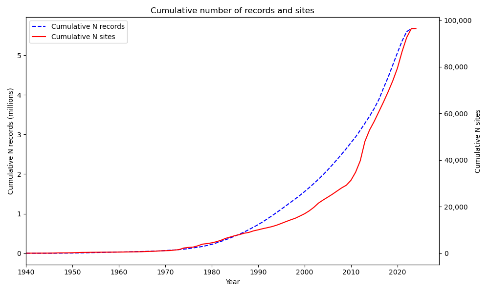
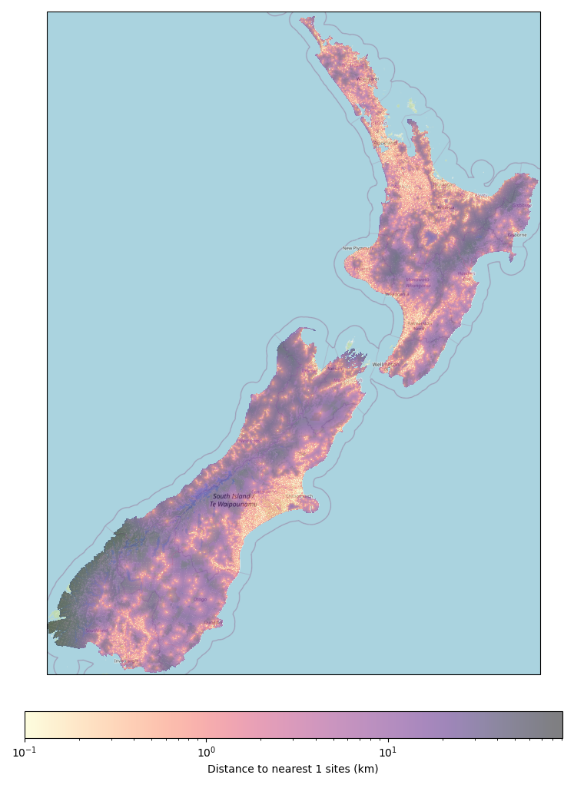
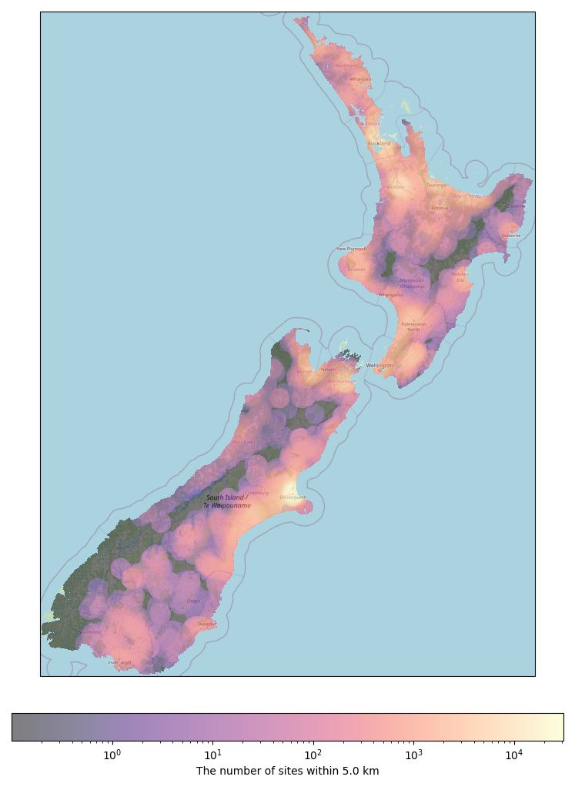

Developing a National Depth to Water Dataset for New Zealand
#################################################################

Patrick Durney :sup:`1*`, Evelyn Charlesworth :sup:`1`, and Matt Dumont :sup:`1`

:sup:`1` Komanawa Solutions Ltd, Christchurch, New Zealand
:sup:`*` Corresponding author

Abstract
==========

Groundwater level data is a fundamental dataset for water resource and shallow water table hazard investigation, but the data are often held in a fragmented and diverse array of databases across New Zealand. Here we describe a National New Zealand dataset of depth to water and groundwater elevation data. This dataset has been made publicly available via a python package and is available at https://github.com/Komanawa-Solutions-Ltd/komanawa-nz-depth-to-water.  We have provided a pathway for future updates and for users to identify and flag issues with the dataset. We hope this dataset can save future researchers time and effort in collecting and processing groundwater level data and can be used for a range of applied science and research activities.

Introduction and Background
=============================

Groundwater level data are a key input for a broad range of water resource investigation, management and research activities. However, access to national groundwater level data in New Zealand is challenging, because they are held in the various Regional Council and Unitary Authority databases and in the New Zealand Geotechnical Database under a wide array of data architectures. The quality of the data and associated metadata varies significantly; in some instances, the data are subject to rigorous quality assurance processes and include accurate measurement point elevations and spatial coordinates. In other instances, the data comprise single readings of unknown quality with no information on the measurement point elevation or even the depth of the well.

Future Coasts Aotearoa is a NIWA led Ministry of Business, Innovation and Employment (MBIE) Endeavour research programme that combines expertise in Indigenous culture, economics, social, and physical sciences to tackle the issue of sea-level rise in coastal lowland communities by enhancing the evidence base for sea-level rise risks. Key groundwater science outputs include: developing impact and adaptation thresholds for shallow groundwater hazards, producing a national coastal groundwater hazard exposure assessment and national and local models of seawater intrusion and water table shoaling.

This technical note outlines the data collected and the methods used to produce and analyse a national depth to water dataset for New Zealand for the Future Coasts research programme. The dataset will be valuable for a range of applied science and research activities.

Methodology
=============

Data gathering scope
----------------------

Groundwater level data can be grouped into discrete measurements and regular monitoring. The former include spot values recorded during/immediately after well drilling, measurements taken during geotechnical investigations (e.g. Cone Penetration Tests, geotechnical bores and trial pits) and piezometric surveys undertaken by Regional Councils. The latter includes manual and instrument-based regular data collection programmes undertaken by Regional Councils, Unitary Authorities and some Territorial Authorities. Groundwater level readings are also collected in accordance with consent conditions for certain activities. However, these data are typically stored in reports and spreadsheets within large file sets within records management systems operated by Regional Council and Unitary Authority consenting and compliance teams. Consequently, they are not accessible without significant investment of resources. Our data collection was therefore constrained to discrete readings and regular monitoring data within Regional Council and Unitary Authority groundwater level databases and the New Zealand Geotechnical Database.

Data Request
---------------

Data requests were sent out to 16 New Zealand councils in March 2023; this included all 11 regional councils and five unitary authorities. A further data request was sent out to all of the District and City Councils. However, this did not uncover any new data beyond that provided by Tauranga City Council, and most recommended we contact the Regional Council in their area instead. The data request sought all groundwater level data; this included sites additional to any NGMP monitoring sites, as well as any discontinuous or sporadic readings. The aim was to collect as much national data as possible, including sites with a single reading. We were open to receiving both groundwater depth and/or groundwater elevation data on the proviso that it was specified to reduce data processing error. We also requested standard metadata for each site, with a minimum metadata requirement of:

- Unique site identifier (e.g. site number)
- Grid reference in NZTM
- Well depth

Our preferred metadata requirements included:

- Screen top & bottom depth
- Surveyed elevation of the ground surface at the measuring point
- The distance between the measuring point and the general ground surface.

The data were received in Excel and csv formats, with various degrees of completeness and processing. Data management and storage varied from council to council, hence processing to standardise the data was required.

Alongside the direct requests to regional councils and unitary authorities, data was also pulled from Tethys (https://github.com/tethys-ts), which allows Hilltop based data to be accessed and downloaded. For councils that had relevant and up-to-date data in Hilltop, it meant we did not have to rely on a response to the direct request, and saved time in the data collection and processing.

A brief summary of the data collected from each council is provided below.

.. include:: ../tables/data_provided_summary.rst

Data Processing
------------------

The data was processed using Python. The scripts used to process the data are available on GitHub; these are open source, and we encourage others to use and adapt them for their own purposes, as well as flag any issues or areas of improvement.

The systematic approach to the data processing was as follows:

- Ingestion and Preliminary Cleaning
    - Individual scripts were developed for each council to cater to the unique formats of the datasets provided.
    - GWL data, alongside metadata, were ingested from two primary sources: direct council submissions and the Tethys platform, accessed via a Python API call.
    - Preliminary cleaning involved standardising data formats, renaming columns for consistency, and excising superfluous columns.
- Data Standardisation and Transformation
    - The data was processed to ensure the presence of both depth-to-water and elevation measurements. In instances where elevation data was absent, LiDAR data was utilised to ascertain site elevation.
    - Anomalies such as negative values or readings beyond expected ranges were meticulously examined and rectified. Erroneous NaN values were also purged from the dataset.
    - All spatial data were transformed into the NZGD 2000 Transverse Mercator projection and NZVD2016 vertical datum.
    - The data was resampled to a consistent temporal resolution, ergo standardised to daily intervals.
    - The data was checked for any duplicates and these were removed.
- Metadata Synthesis and Alignment
    - Metadata processing paralleled the data cleaning steps, with additional emphasis on ensuring alignment between site names in the metadata and the GWL data.
    - The metadata schema encapsulated a comprehensive array of fields, ranging from well names and depths to spatial coordinates and screening details.
    - Groundwater elevations were meticulously derived from ground elevation plus collar height (where available) minus depth to water, except for instances where councils provided elevations in NZVD2016.
- Data Aggregation and Quality Assurance
    - The processed data from various sources were coalesced into a singular dataset. This aggregation involved strategic merging and deduplication, governed by predefined rules to ensure data integrity.
    - Quality control measures, including data and metadata checks, were instituted to uphold accuracy and reliability.
- Storing and Accessing Processed Data
    - The culminated GWL data and metadata were systematically stored in an HDF5 store, facilitating ease of access and analysis.
    - Provisions were made to recalculate and update the stored data as necessary, ensuring the database can remain current and reflective of the most recent submissions.
- Assumptions and Usage Considerations
    - A fundamental assumption is that depth-to-groundwater measurements below the ground surface are positive, with negative readings indicative of artesian conditions. This necessitated sign adjustments and validation against council records.
    - In cases where well depth information was unavailable, wells were presumed shallow rather than being excluded from the dataset; however the well depth is still flagged as a NaN value.
    - Specific regional peculiarities, such as the assumed + 100 m offset for coastal groundwater elevations provided by the Otago Regional Council, were duly considered and adjusted.
    - For wells where the maximum depth to water exceeded the reported well depth, an assumption was made that the well depth equaled the maximum depth to water plus an additional 3 metres.

Statistical Analysis of Water Table Variation
-------------------------------------------------
The National Depth to Water Dataset was complied to produce maps of steady-state depth to water (DTW) at a national scale, aiding in the identification of areas at risk of groundwater inundation for the Future Coasts Aotearoa research programme. Simple statistical analyses were performed to uncover any prominent traits and generally describe the data. The steps were:

-  Categorization by Depth:
    - The dataset was divided into three depth categories:
        - Category 1: Sites with DTW less than 10 meters.
        - Category 2: Sites with DTW between 10 and 30 meters.
        - Category 3: Sites with DTW greater than 30 meters.

- Sub-setting by Number of Readings:
    - Only sites with more than 30 readings were included. This threshold was chosen as a rule of thumb to ensure a reliable calculation of the standard deviation.

- Statistical Calculations:
    - For each site in the subset, the following statistical measures were computed:
        - Mean: The average depth to water.
        - Standard Deviation: A measure of the variation in water levels.
        - Minimum: The lowest recorded water level.
        - Maximum: The highest recorded water level.

- Grouping by Mean DTW:
    - The categories were prescribed with breakpoints of: 0.1, 0.5, 1, 1.5, 2, 3, 5, 10, 15, 20, 30, 50, 75, 100 meters
    - The data was further grouped by the mean DTW to analyse combined statistics across different groups. This grouping allows for a comparison of water level characteristics across sites with similar mean DTW values.

This structured approach to data analysis supports a comprehensive understanding of the DTW across various sites. By categorising, sub-setting, and computing key statistics, we can identify patterns and traits that are crucial for assessing groundwater inundation risks at a national scale.

Results and discussion
============================

Dataset access
-----------------

The final dataset is available via a Python package at https://github.com/Komanawa-Solutions-Ltd/komanawa-nz-depth-to-water. The package readme includes installation instructions, usage examples, metadata descriptions, and instructions for contributing and maintaining the dataset.

Description of Dataset
-----------------------------------
The dataset comprises a comprehensive collection of groundwater monitoring sites, spanning a significant temporal range from as early as December 29, 1899, but is overwhelmingly composed of younger data. More than half of the sites and records are measured after the mid-late 2000s, as shown in the figure below.  The cumulative number of sites and records shown by data source is available in the supplementary material and `GitHub repository <https://github.com/Komanawa-Solutions-Ltd/komanawa-nz-depth-to-water>`_.

   The growth in the number of sites and records over time

A statistical summary of the dataset is provided below.

.. include:: ../tables/full_dataset_summary.rst

Investigating the dataset by source reveals distinct patterns in data collection and density.
Notably, Environment Canterbury (ECan) stands out with the highest number of observations.
This contrasts the New Zealand Geotechnical Database (NZGD) which has many fewer observations per site (frequently <= 2 readings/site).
Otago Regional Council (ORC) provided data for fewer monitoring sites, but with a high average reading count per site.
These variations highlight the diversity of monitoring efforts and data densities across different sources.
Collectively, these statistics underscore the heterogeneity of groundwater monitoring across regions, influenced by the varying goals (e.g. geotechnical investigations), methodologies, and resources.
Further summary statistics of the data by the source are provided below.

.. include:: ../tables/by_source_summary.rst

Spatial Distribution
--------------------------

To better describe the spatial extent of the dataset we have plotted the number of monitoring points within 5 km of each monitoring point and the distance to the nearest groundwater monitoring site. The figures below show the results of these analyses below. In addition, these figures and geotiffs of the data coverage are available in the supplementary material and the Github repository.

   Distance to the nearest groundwater monitoring site

   Number of monitoring points within 5 km

.. raw:: latex

    \clearpage

Statistical Description of Depth to Water Variance
-------------------------------------------------------

Overview depth to water variance statistics for shallow wells are provided below. More detailed statistics are provided in the supplementary material and available on the `GitHub repository <https://github.com/Komanawa-Solutions-Ltd/komanawa-nz-depth-to-water>`_.

In depth category 1 (shallow wells, < 10m), the depth to water exhibits little variation in the shallower bins, suggesting proximity to boundary condition and/or high (unconfined) storage coefficients.
As depth increases, the variability in the depth to water also increases, as evidenced by larger ranges and higher standard deviations. For instance, in depth category 1, the standard deviation median increases from 0.077 in the <0.1 m bin to 0.48 in the 6.36 m bin. Notably, the skewness suggests a tendency towards shallower water levels in many records, despite the large possible ranges in depth. This is observed in the negative skewness values that become more pronounced with increasing depth, indicating that while the average water levels are deeper, there are frequent instances of shallower depths. The kurtosis values further highlight the presence of notable outliers and extreme values. As depth increases, the kurtosis medians remain high or increase, indicating distributions with frequent extreme values. This pattern is consistent across other depth categories, where deeper bins show increased kurtosis, suggesting that extreme values become more apparent with depth. Overall, the statistics indicate that as depth increases, not only does the variability in water levels increase, but the presence of outliers and extreme values also becomes more pronounced. Finally, the statistics suggest the data is skewed and leptokurtic, meaning the data is not normally distributed and the mean and standard deviation are not necessarily representative of the data.

.. include:: ../tables/stats_depth_cat_1.rst

Conclusions
=============

Access to fundamental groundwater data is essential for understanding the dynamics of groundwater systems and their interactions with the environment.
New Zealand's current groundwater monitoring network is diverse and fragmented, with each provider having unique monitoring objectives, methodologies, and data storage and management systems.
Some national approaches have been undertaken to standardise data collection and storage, such as the National Groundwater Monitoring Programme (NGMP) and the New Zealand Geotechnical Database (NZGD), but these are not comprehensive, do not cover the full breadth of groundwater monitoring data, and often have a specific focus (i.e. regional groundwater resource characterisation or shallow geotechnical investigations, respectively).

The current state of groundwater level data availability in New Zealand provides a significant barrier to and inefficiency in understanding and adapting to the impacts of climate change and sea-level rise on groundwater systems.

A comprehensive set of discrete and regular groundwater level readings and metadata were collated from Regional Councils, Unitary Authorities and the New Zealand Geotechnical Database and processed into a consistent format. The output of this work is a national depth to water and groundwater elevation dataset for New Zealand; the groundwater level data and metadata are available as a complete dataset which can be used to better understand shallow groundwater hazards in New Zealand and for a range of other applied science and research activities such as well interference assessments, stormwater detention pond groundwater depth assessments and regional and national groundwater modelling.
Although the database provides a comprehensive set of groundwater level data at the time of writing, the value of this database will decline over time as new data is collected.

We are aware of efforts to create a national wells database, which would likely provide significant improvements in data quality and accessibility. However, it is unclear when this database will be available and what data it will contain. We would recommend that a pragmatic set of standards be adopted for all data held by councils and other organisations that collect groundwater data. These standards should include the following:

#. All public data held by an organisation should be made available via a public API.
#. All public datasets should include metadata.  Ideally this metadata would be in a standard machine readable format, but as an interim solution or for less frequently used data, a simple publicly visible document discussing the data structure and any peculiarities would be a good start.
#. All public datasets should have a mechanism for users to report errors or issues with the data and these issues should be publicly visible. Even if organisations do not have the resources to fix all these issues, there is value in collating them. At the moment each researcher must discover these issues themselves, which is challenging and time consuming. Consider the value of forums like Stack Exchange or GitHub issues for this purpose in the software development world.
#. All public datasets should have consistent +ve or -ve signs for depth to water above or below ground level. Ideally this would be a national standard, but minimally should be an organisational standard and documented.
#. All public datasets should have a consistent way of specifying the elevation of the measuring point. This could be as simple as a GPS elevation, but minimally should be documented.

Additionally, we would like to commend the NZGD for their work in providing a national database of geotechnical data. The dataset was of enormous value to this project, particularly in data sparce regions; however our use case may have been beyond the expected purpose of the NZGD. Specifically, we often found significantly conflicting data points in close proximity. Based on our analysis, we suspect that these discrepancies likely stem from variations in the drilling locations, such as greenfield sites versus foundation pits. The NZGD could significantly improve their database for shallow groundwater hazard management by:

#. Included a field to specify whether measurements at a point are relative to the average surrounding land surface or taken in foundation excavations.
#. Include and possibly mandate the provision of GPS elevation data for the depth to water measuring point and/or a measured distance between the measuring point and the general surrounding ground surface (e.g. depth of foundation excavation).
#. As discussed above the NZGD would also benefit from:
    #. A public API for data access.
    #. A publicly visible mechanism for users to report issues, inconsistencies, and concerns with the data.

Finally we have some specific recommendations that could be undertaken to improve the dataset we have produced:

- Further quality assurance of the data, including cross-referencing the finalised data with councils.
- Further analysis of the data to identify any potential errors or outliers.
- Updating the dataset with new data as it becomes available.

Contributing and issues/bugs
==============================

We have made every attempt to ensure the quality of the data and code in this repository. However, inevitably, there will be issues with the data or code. If you find an issue, please raise an issue on the GitHub repository https://github.com/Komanawa-Solutions-Ltd/komanawa-nz-depth-to-water/issues. If you would like to contribute to the code or data, please fork the repository and submit a pull request.  While we would like to commit to maintaining this dataset in the future, we are a small team and may not have the resources to do so. If you would like to become a longer term contributor to this dataset, please get in touch.

Limitations
=============
While we have made every attempt to ensure the quality of the data and code in this repository, we do not provide any explicit or implicit guarantee of the datasets produced or methods provided here. In addition, by proving the base data, the data providers have also not provided any explicit or implicit guarantee of these data. Data errors will inevitably exist in the dataset, and we encourage users to report these errors to us so that we can correct them.

We are aware of limitations of this work which are listed below:

- We have made a series of assumptions during the data processing; these are discussed above.
- The data is only as good as the data provided by the councils; we did not have the resources nor all the information to fully quality-assure the data.
- For many sites, the elevation of the measuring point is unknown. We have used LiDAR data to estimate the elevation of the ground, but this will likely reduce the accuracy of the groundwater elevation depending on the resolution of the LiDAR data.
- We have assumed that the depth to water from ground level is correct, and therefore any errors in the depth to water data will be reflected in the groundwater elevation values.
- There may be unknown regional data handling/reporting peculiarities that we were not aware of that could affect the data.
- The dataset is not exhaustive, and there may be more data available that has not been included in this dataset.

Acknowledgements
==================

This work could not have been completed without the support of the Regional Councils, Unitary Authorities, and other scientists who provided us with data and assistance. We would like to acknowledge the Regional Councils and Unitary Authorities, especially their environmental data teams, for providing us with the required data, and for responding to our data requests and subsequent questions. We would like to acknowledge the following people and organisations:

- Freya Green from Auckland Council
- Paul Scholes, Breda Savoldelli & Rochelle Gardner from Bay of Plenty Regional Council
- Jennifer Tregurtha from Environment Canterbury
- Julia Kendall from Gisborne District Council
- Ale Cocimano from Hawkes Bay Regional Council
- Michaela Rose from Horizons Regional Council
- Charlotte Tomlinson from Marlborough District Council
- Susie Osbaldiston & Sandrine Le Gars from Northland Regional Council
- Marc Ettema from Otago Regional Council
- Fiona Smith from Environment Southland
- Sarah Avery from Taranaki Regional Council
- Matt McLarin from Tasman District Council
- Debbie Eastwood & Sung Soo Koh from Waikato Regional Council
- Rob Van Der Raaij from Wellington Regional Council
- Jonny Horrox from West Coast Regional Council
- Simon Matthews from the New Zealand Geotechnical Database
- Chris Strang from Nelson City Council
- Mike Kitteridge for his development of Tethys, and for providing assistance in using the platform and accessing data.
- The New Zealand Geotechnical Database for providing us with groundwater level data.
- Armandine Bosserelle for providing us with groundwater level data for the Christchurch area.
- Karen Grant & Nektaria Papadopoulos from Tauranga City Council.

This work was made possible by the Future Coasts Aotearoa programme, funded by the Ministry of Business, Innovation and Employment (MBIE) Endeavour Fund. We would like to acknowledge the support of the programme, NIWA, and the other researchers involved in the project.

.. include:: supplmental_information.rst