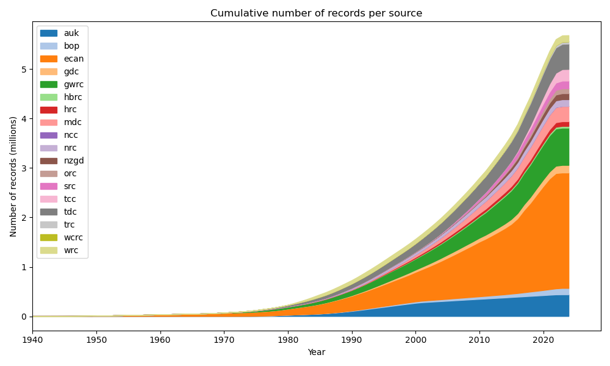
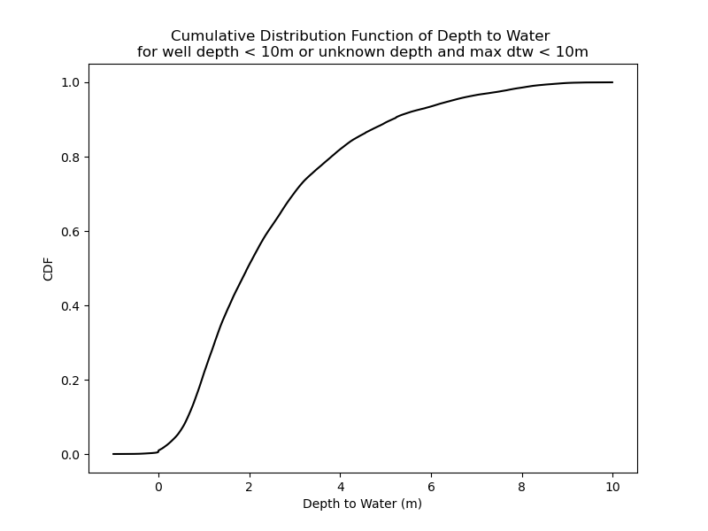
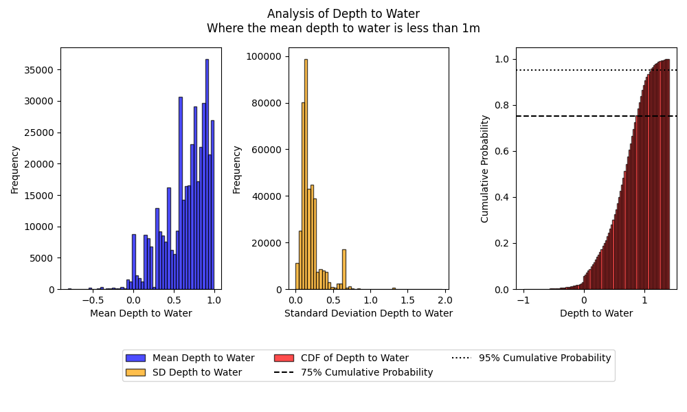
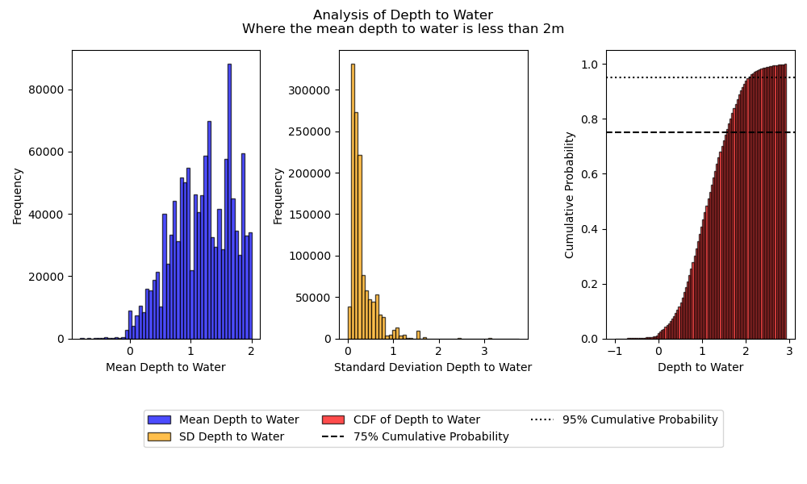

Supplementary Material
==========================

The following tables and figures are supplementary material for the paper and are included here to provide additional, readily accessible information about the dataset.

Cumulative records and sites per source
----------------------------------------

The following figures show the cumulative number of records and sites over time per data source.

    Figure S1 The growth in the number of records by source over time.

.. figure:: ../_static/cumulative_n_sites_per_source.png
    :align: center

    Figure S2 The growth in the number of sites by source over time.

Summary of variance and skewness of depth to water
--------------------------------------------------

The following tables summarize the variance and skewness of the depth to water measurements (across time) for all sites in given depth categories.

.. include:: ../tables/stats_depth_cat_1.rst

.. include:: ../tables/stats_depth_cat_2.rst

.. include:: ../tables/stats_depth_cat_3.rst

Frequency and probability of shallow depth to water
---------------------------------------------------

The following tables summarize the frequency and probability of shallow depth to water measurements (across time) for all sites in given depth categories.

.. include:: ../tables/prob_less_0.1.rst

.. include:: ../tables/prob_less_0.5.rst

.. include:: ../tables/prob_less_1.rst

Histograms of depth to water
----------------------------

The following figures show histograms of the mean depth to water, the standard deviation of depth to water (at each site) and the cumulative probability of depth to water (across time) for all sites in given depth categories.

    Figure S3 Cumulative probability of depth to water for shallow wells

.. figure:: ../_static/hist_sd_depth_to_water_lt_inf.png
    :align: center

    The mean depth to water, histogram of the standard deviation of depth to water and the cumulative probability of depth to water for all sites.

.. figure:: ../_static/hist_sd_depth_to_water_lt_0.5.png
    :align: center

    Figure S4 The mean depth to water, histogram of the standard deviation of depth to water and the cumulative probability of depth to water for all sites where the mean depth to water is less than 0.5 m.

    Figure S5 The mean depth to water, histogram of the standard deviation of depth to water and the cumulative probability of depth to water for all sites where the mean depth to water is less than 1 m.

    Figure S6 The mean depth to water, histogram of the standard deviation of depth to water and the cumulative probability of depth to water for all sites where the mean depth to water is less than 2 m.
